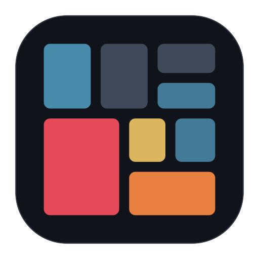
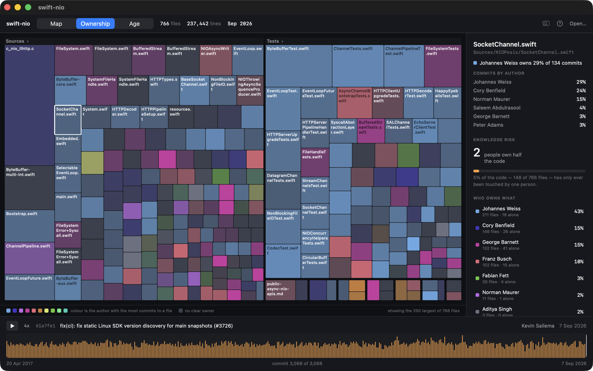

# Codewake



A native macOS app that treats a Git repository's history as a timeline you can scrub.
Drag the playhead and watch the codebase change: files appear, directories grow, hotspots
heat up, the files that secretly change together light up, and the parts of the codebase
only one person has ever touched show themselves.


## Why

Git is good at telling you *what* changed and *when*. It is much worse at telling you
where the risk lives. A file that is large, tangled, and edited every week is the one most
likely to break when you touch it, but nothing in `git log` puts that in front of you.

Codewake computes hotspots (churn × complexity), change coupling, and ownership at every
point in a repository's history, and draws them as a map you can scrub through time.

## Installing

Download `Codewake.zip` from the [latest release](../../releases/latest), unzip it, and drag
`Codewake.app` to your Applications folder. It is a universal binary and needs macOS 15 or
later.

The app is signed **ad-hoc**, not with a paid Apple Developer ID, so macOS quarantines it on
first launch and refuses to open it. Either:

```sh
xattr -dr com.apple.quarantine /Applications/Codewake.app
```

or open it once, then go to **System Settings → Privacy & Security**, scroll to the bottom
and click **Open Anyway**. macOS only asks once.

### From source

Requires macOS 15+ and Xcode 16+ (built against Swift 6.3).

```sh
swift run codewake
```

Then open any local repository. To skip the picker:

```sh
swift run codewake -repo ~/some/repo
# or
CODEWAKE_REPO=~/some/repo swift run codewake
```

To build the bundle yourself:

```sh
./Scripts/bundle.sh                  # universal, into dist/
ARCHS=arm64 ./Scripts/bundle.sh      # this machine only, much faster
```

If you are new to these metrics, the **?** button in the toolbar (or `⌘/`) explains every
term the interface uses.

### Controls

| | |
| --- | --- |
| Drag the timeline | Move through history |
| `←` `→` | Step one commit |
| `Space` / `⌘P` | Play or pause |
| `⌘⌥←` `⌘⌥→` | Jump to the first or last commit |
| `⌘1` `⌘2` `⌘3` | Switch between the map, ownership, and age |
| `⌘F` | Filter files, so matches stay lit and everything else dims |
| Click a folder's name | Open it, so its files get the whole canvas |
| `⌘L` | Zoom on small files, on or off |
| `Esc` | Clear the search, the author, the selection, then step back out |

## What it shows

**The map.** Every file that exists at the current moment, sized by length, coloured by
hotspot score, grouped by top-level directory. Selecting a file outlines the files it
usually changes with, so a hidden cluster becomes visible at a glance. Clicking a folder's
name opens it, handing its contents the whole canvas; directories that can be opened carry
a chevron. Turn on the magnifier with `⌘L` or
the toolbar button and hovering a rectangle too small to carry a name will enlarge the area
around it.

**The ownership map.** The same rectangles, coloured by whoever has the most commits to
each file, and faded toward grey where no one person has a real claim on it. Blocks of one
colour are the parts of the codebase a single person holds. The panel beside it counts how
much of the code has only ever been touched by one person, and how few people it would take
to lose half of it.



**The age map.** The same rectangles again, coloured by how long it has been since anyone
touched each file. Bright is where the work is; dark is code nobody has had a reason to
open, which is either the stable foundation or the part everyone is afraid of. Scrubbing
makes the point better than a screenshot can: play the history and watch the codebase cool
behind the playhead as the work moves on.


**The inspector.** For the selected file at the selected moment: its size, its churn, its
nesting depth, who has touched it, what it changes with, and how its churn was distributed
over time.

## How it works

```
git log ──▶ parse ──▶ file timelines ──▶ snapshot engine ──▶ hotspots ──▶ map
                                               │           └─▶ coupling ──▶ outlines
                                               ▲
                                          scrub position
```

`CodewakeKit` holds all of it and imports no UI framework, so every part is testable
without a window. The app target is just views over that engine.

A few decisions that carry the project:

**One pass over history, then never git again for churn.** A single
`git log --raw --numstat -M` gives per-commit line counts, rename tracking, *and* the
post-image blob SHA of every change. That last part removes a whole subsystem: because
each file event records its own blob, the contents of any file at any point in history are
reachable without walking trees.

**Scrubbing is incremental, in both directions.** The snapshot engine holds the repository
state at commit `i`; moving to `j` applies or unapplies only the commits in between, so
cost scales with the size of the jump rather than the size of the repository. Every
quantity it tracks is either additive or a count of applied events, which makes stepping
backwards exactly as cheap and exactly as accurate as stepping forwards, with no undo log
anywhere. A property test asserts that scrubbing to a position from either direction produces
identical state.

**Coupling needs no index.** Finding what a file changes with looks like it needs a
precomputed table of every file pair, which is expensive to build and to keep correct
while scrubbing. It does not: a file's own event list already names every commit that
touched it, and each of those commits already names every other file it touched. Walking
that costs a pass over one file's history, so coupling is answered on demand for whatever
was just clicked. Commits touching more than 25 files are ignored, because a mass rename
couples everything to everything and means nothing.

**Ownership is counted in commits, not surviving lines.** `git blame` answers "whose lines
are these right now", which is the fragile version of the question: one reformat or one
rename rewrites every line's author without moving any knowledge. Who keeps coming back to
change a file is the durable signal, and it falls straight out of the history already
parsed. Unlike coupling it cannot be answered for one file on demand, because the question
is about the shape of the whole codebase, so it walks every live file's applied events.
That is why the app runs it once the playhead settles and caches the answer per position
rather than on every frame.

**Complexity is measured lazily and cached by blob SHA.** Reading file contents is the only
expensive operation, so it happens only for the top files by churn, only once the playhead
stops moving, and never twice for the same content. During a drag the view scores files
using size as a stand-in and refines once you let go.

## Performance

Two repositories, four orders of magnitude apart. The first is a 1,836-commit application;
the second is git's own history, at 60,896 non-merge commits (82,154 including merges),
5,004 files and 1,631,907 lines at HEAD.

| Operation | 1,836 commits | 60,896 commits |
| --- | --- | --- |
| Load and index | 0.75s | 28s |
| Scrub step (cached) | 0.05ms | 0.18ms |
| Repository-wide ownership | 1ms | 18ms |
| Repository-wide file age | 1.0ms | 5.5ms |
| Treemap layout, 250 tiles | 0.37ms | 0.18ms |
| First complexity measurement | 0.17s | 0.95s |
| Repeat measurement (cached) | 0.22ms | 0.58ms |
| Memory, resident | 16 MB | 156 MB |

Everything that happens while the app is open stays far inside a frame at both sizes, and
memory grows roughly with the number of file events rather than with the number of commits.

**Loading is the one thing that does not scale, and it is not Codewake's code.** Of the 28
seconds on git's history, 27.1 goes on reading the log, and only 0.21s of that is parsing:
the rest is `git log --raw --numstat` producing 27 MB of output. Building the file timelines
costs another 0.36s, and counting the commits up front, so the wait can be described rather
than merely spun at, costs 0.7s. Run on its own with the same arguments, `git log` takes 21
seconds. Making a large repository open quickly would mean not reading its whole history up
front, by loading around the playhead or caching a parsed history on disk, rather than
optimising anything in the current path.

Since none of that is fixable from here, the app says so rather than hiding it: a repository
over twenty thousand commits gets its commit count and an explanation of where the wait is
going, instead of an unqualified spinner.

Reproduce with `CODEWAKE_BENCH_REPO=~/some/repo swift test -c release --filter BenchmarkTests`.

## Tests

```sh
swift test
```

80 tests covering the log parser against real git output (renames, binary files,
deletions, awkward commit subjects), the snapshot engine's forward/backward equivalence,
coupling thresholds, ownership and bus factor as the playhead moves, file age across scrubs
and renames, complexity scoring, treemap geometry including that no file is ever too small
to be drawn, the rules about which directory a click may open, and an end-to-end pass over
a repository the test builds itself.

GitHub Actions runs the same tests on every push, then builds and signs `Codewake.app` and
attaches it to any tagged release.

## Limitations

Complexity is a proxy, not a parse. Only the current branch's history is read, so work
that never landed on it does not appear. Merge commits are skipped when counting churn, so
work is not counted twice. Authors are identified by the name on the commit, so one person
committing under two names counts as two people unless the repository has a `.mailmap`,
which is read if present. There is no architecture or dependency view.

Opening a very large repository takes about half a minute, almost all of it spent waiting
for `git log`, which the app says while you wait. See Performance.

A hotspot is a question, not a verdict. It says where to look, not what is wrong.

## License

MIT
