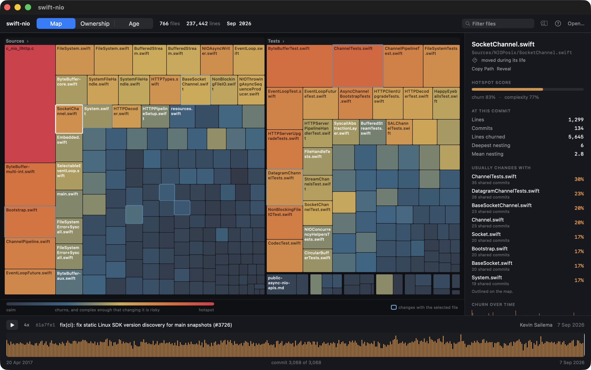

# Codewaker

A native macOS app that treats a Git repository's history as a timeline you can scrub.
Drag the playhead and watch the codebase change: files appear, directories grow, and
hotspots — the code that is both complex and frequently changed — heat up and cool down.



## Why

Git is good at telling you *what* changed and *when*. It is much worse at telling you
where the risk lives. A file that is large, tangled, and edited every week is the one most
likely to break when you touch it, but nothing in `git log` puts that in front of you.

Codewaker computes the classic hotspot measure — churn × complexity — at every point in a
repository's history, and draws it as a treemap you can scrub through time.

## Running it

Requires macOS 15+ and Xcode 16+ (built against Swift 6.3).

```sh
swift run codewaker
```

Then open any local repository. To skip the picker:

```sh
swift run codewaker -repo ~/some/repo
# or
CODEWAKER_REPO=~/some/repo swift run codewaker
```

**Controls** — drag anywhere on the timeline to scrub, `←`/`→` to step one commit,
space or `⌘P` to play the history back, click any rectangle to inspect that file.

## How it works

```
git log ──▶ parse ──▶ file timelines ──▶ snapshot engine ──▶ hotspot scoring ──▶ treemap
                                              ▲                     │
                                              └── scrub position    └── complexity cache
```

`CodewakerKit` holds all of it and imports no UI framework, so every part is testable
without a window. The app target is just views over that engine.

A few decisions that carry the project:

**One pass over history, then never git again for churn.** A single
`git log --raw --numstat -M` gives per-commit line counts, rename tracking, *and* the
post-image blob SHA of every change. That last part removes a whole subsystem: because
each file event records its own blob, the contents of any file at any point in history are
reachable without walking trees.

**Scrubbing is incremental, in both directions.** The snapshot engine holds the repository
state at commit `i`; moving to `j` applies or unapplies only the commits in between, so
cost scales with the size of the jump rather than the size of the repository. Every
quantity it tracks is either additive or a count of applied events, which makes stepping
backwards exactly as cheap and exactly as accurate as stepping forwards — there is no undo
log. A property test asserts that scrubbing to a position from either direction produces
identical state.

**Complexity is measured lazily and cached by blob SHA.** Reading file contents is the only
expensive operation, so it happens only for the top files by churn, only once the playhead
stops moving, and never twice for the same content. During a drag the view scores files
using size as a stand-in and refines once you let go. On a 1,800-commit repository a first
measurement takes ~380ms and a repeat is ~2ms.

## Performance

Measured on a real 1,836-commit, 885-file repository:

| Operation | Time |
| --- | --- |
| Load and index full history | 0.87s |
| Scrub step (cached) | 1.16ms |
| First complexity measurement | 0.38s |
| Repeat measurement (cached) | 2.4ms |

Reproduce with `CODEWAKER_BENCH_REPO=~/some/repo swift test --filter BenchmarkTests`.

## Tests

```sh
swift test
```

Covers the log parser against real git output (renames, binary files, deletions, awkward
commit subjects), the snapshot engine's forward/backward equivalence, complexity scoring,
treemap geometry, and an end-to-end pass over a repository built by the test itself.

## Limitations

Hotspots only, for now. Change coupling, ownership, and an architecture view are the
obvious next things and the engine already carries most of what they need — `FileDetail`
reports per-author commit counts, and the snapshot engine can answer "what changed
together" from data it already holds. Complexity is a proxy, not a parse. Only the current
branch's history is considered, and merge commits are skipped so their churn is not counted
twice.

## License

MIT
